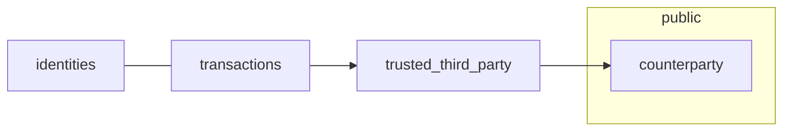
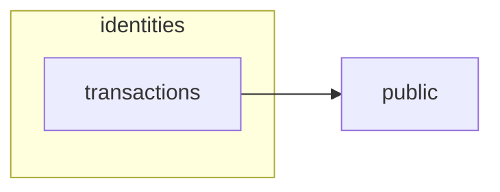
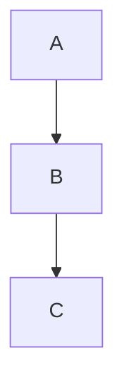

---
title:
 - Bitcoin Core -- Conceptual Architecture
author:
 - Cain Susko & Yash Patel
theme:
 - Berkeley
date:
---

# Introduction

Bitcoin core is the reference implementation of the Bitcoin system and is the
_authoritative_ source for how each part of the technology should be
implemented.

Bitcoin Core is a Peer to Peer (P2P) system, meaning all interactions between users are authenticated by each other -- rather than a centralized server.

Security is achieved through computation to build confidence in transactions.
The key to Bitcoin Core's integrity is a shared transaction history that is so
computationally expensive it would be near impossible to reverse or fake.

# Traditional Privacy Models

In the old model of privacy, banks or other "trusted" third parities would
verify and secure transactions -- without the ability for the public to
cross-check or self-verify.

# New Privacy Model

The difference in the new privacy model is that the _public_ verifies and
secures transactions -- facilitating a more open and democratic financial
system.

# What is Bitcoin?

 - Bitcoin is a unit of currency used to retain, send, & receive value among
   participants in the Bitcoin network.

 - Participants in the Bitcoin network communicate with each other through the
   Internet -- using a protocol which can be run on a wide range of computing
   devices (including laptops and smart-phones).

 - The Bitcoin protocol uses a peer-to-peer architecture which means that
   participants in the network communicate directly with each other -- rather
   than through a centralized server.

# How is Bitcoin Created & Stored?

 - Bitcoin are generated through a process known as "mining" which involves
   competing with other participants on the Bitcoin network to find solutions
   to complex mathematical problems in order to validate other transactions on
   the network.

   - On average, a Bitcoin "miner" can validate the transactions from the last
     10 minutes; every 10 minutes. This results in the miner getting 1 bitcoin
     every 10 minutes.

 - Participants in the Bitcoin network do not "own" any coins they have -- but
   instead they own _keys_ which prove their ownership of a coin.
   
   - With these keys participants can "sign" transactions to "unlock" their
     value and spend it by transferring it to a new owner

# TEST

