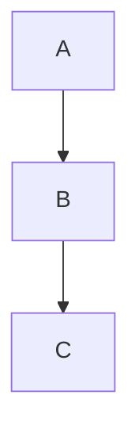

---
title:
 - Bitcoin Core -- Conceptual Architecture
author:
 - Cain Susko & Yash Patel
theme:
 - Berkeley
date:
---

# What is Bitcoin?

 - Bitcoin is a unit of currency used to retain, send, & receive value among
   participants in the Bitcoin network.

 - Participants in the Bitcoin network communicate with each other through the
   Internet -- using a protocol which can be run on a wide range of computing
   devices (including laptops and smart-phones).

 - The Bitcoin protocol uses a peer-to-peer architecture which means that
   participants in the network communicate directly with each other -- rather
   than through a centralized server.

# How is Bitcoin Created & Stored?

 - Bitcoin are generated through a process known as "mining" which involves
   competing with other participants on the Bitcoin network to find solutions
   to complex mathematical problems in order to validate other transactions on
   the network.

   - On average, a Bitcoin "miner" can validate the transactions from the last
     10 minutes; every 10 minutes. This results in the miner getting 1 bitcoin
     every 10 minutes.

 - Participants in the Bitcoin network do not "own" any coins they have -- but
   instead they own _keys_ which prove their ownership of a coin.
   
   - With these keys participants can "sign" transactions to "unlock" their
     value and spend it by transferring it to a new owner

# What is Bitcoin Core?
 - Bitcoin Core is a reference implementation of the bitcoin system and the authoritative reference for technology implementation.
 - The system uses a peer-to-peer architecture style to provide an electronic payment system without trusted third parties.
 - The blockchain, a public ledger of transactions, is used by every peer in the network to verify payments and prevent double spending.
 - Goals: open-source, peer-to-peer, private electronic payment system.
 - Main architecture style: peer-to-peer with layers dividing the user interface, local system, and peer network.
 - Submodules and components: network and nodes, transactions and blockchain, user wallets and interfaces.
 - Examined in detail to understand the system's function, data flow, and evolution towards its primary goals.

# About Bitcoin Core
 - About the Bitcoin Core system
 - Nodes
 - BlockChain and Blocks
 - Wallets, Keys, and Transacitons

# About the Bitcoin Core System
 - Purely peer-to-peer electronic payment system
 - Network formed by nodes (computers running Bitcoin software)
 - Three main node types: full, miner, and light nodes
 - Full nodes store full copy of blockchain and verify transactions
 - Nodes broadcast valid transactions to others, leading to agreement and addition to pool of valid transactions.

# Nodes Nodes Nodes! (Slide 1: *Nodes*)
 - Miner nodes pick transactions from pool of valid transactions, package into blocks, and broadcast to nodes
 - Full nodes verify blocks and add to blockchain, reaching consensus and adding to public ledger
 - Miners rewarded for adding blocks to blockchain

# Nodes Nodes Nodes! (Slide 2: *SPV Nodes*)
 - Maintain only subset of blockchain and verify transactions using simplified payment verification method
 - Designed for power and space constrained devices (e.g. smartphones)
 - Verify chain of blocks and link to transaction of interest

# Nodes Nodes Nodes! (Slide 3: *Architectural Styles*)
 - Peer-to-peer architecture in operational view
 - Layered style in functional viewpoint
 - Top layer: user interface (cell phone apps or websites)
 - Second layer: local version of Bitcoin software (full, miner, or light node)
 - Third layer: connection layer (peer-to-peer network for formatting, sending, and receiving messages)

# Blockchain and Blocks (Slide 1: *B & B*)
 - **Blockchain** is a back-linked list of blocks and transactions, can be thought of as a stack
 - **Blocks** placed at the top, referencing previous block (parent block) through header
 - Genesis block is the first block ever created

# Blockchain and Blocks (Slide 2: Compontents of a Block)
 - Container data structure scheduling transactions for inclusion in public ledger (blockchain)
 - Two components: header and body
 - Header contains metadata (previous block hash, difficulty, timestamp, nonce, merkle tree root)
 - Body contains all transaction data (on average, more than 1900 transactions)

# Wallets, Keys, and Transactions (Slide 1)
 - Wallet is the primary user interface, controls access to user's money
 - Manages keys and addresses, tracks balance, creates and signs transactions
 - Does not contain bitcoin, but rather keys to "coins" on the network

# Wallets, Keys, and Transactions (Slide 2: Types of Wallets)
 - Nondeterministic: keys independently generated, each key must be backed up
 - Deterministic (seeded): keys derived from common master key (seed), seed is the only thing that needs to be backed up for efficient system.

... (92 lines left)
Collapse
a1presentation.md
12 KB
Attachment file type: acrobat
a1presentation.pdf
169.00 KB
@suspicious cain Do you mind pushing these? i have some conflicts in github that i would just rather clone a new repo lmao. anyways this is the presentation so far. i kept in the test slide in case you needed it. but in this has basically our report, in presentation format
mercy — Yesterday at 8:25 PM
I read through the whole thing out loud and it takes around 4 minutes 
also it doesn't mention data flow, the components of the system in detail (the stuff so far is fine if you run out of time tho), concurrency, or system evolution 
among other things
yash — Today at 9:28 AM
Before I begin my nap I’m just gonna request a few more hands on deck for the presentation
I just need some people to read through the presentation and make some notes about it
After Cain makes his changes, I’m sure it will look pretty minty
mercy — Today at 9:51 AM
The slides u have are great, I can maybe condense the evolution part so it’s not hugely long
@shoe @e-spams are u guys done the diagrams?
mercy — Today at 9:52 AM
What kind of notes do u need? Like help on the script or just comments

---
title:
 - Bitcoin Core -- Conceptual Architecture
author:
 - Cain Susko & Yash Patel
theme:
 - Berkeley
date:
---

# What is Bitcoin?

 - Bitcoin is a unit of currency used to retain, send, & receive value among
   participants in the Bitcoin network.

 - Participants in the Bitcoin network communicate with each other through the
   Internet -- using a protocol which can be run on a wide range of computing
   devices (including laptops and smart-phones).

 - The Bitcoin protocol uses a peer-to-peer architecture which means that
   participants in the network communicate directly with each other -- rather
   than through a centralized server.

# How is Bitcoin Created & Stored?

 - Bitcoin are generated through a process known as "mining" which involves
   competing with other participants on the Bitcoin network to find solutions
   to complex mathematical problems in order to validate other transactions on
   the network.

   - On average, a Bitcoin "miner" can validate the transactions from the last
     10 minutes; every 10 minutes. This results in the miner getting 1 bitcoin
     every 10 minutes.

 - Participants in the Bitcoin network do not "own" any coins they have -- but
   instead they own _keys_ which prove their ownership of a coin.
   
   - With these keys participants can "sign" transactions to "unlock" their
     value and spend it by transferring it to a new owner

# What is Bitcoin Core?
 - Bitcoin Core is a reference implementation of the bitcoin system and the authoritative reference for technology implementation.
 - The system uses a peer-to-peer architecture style to provide an electronic payment system without trusted third parties.
 - The blockchain, a public ledger of transactions, is used by every peer in the network to verify payments and prevent double spending.
 - Goals: open-source, peer-to-peer, private electronic payment system.
 - Main architecture style: peer-to-peer with layers dividing the user interface, local system, and peer network.
 - Submodules and components: network and nodes, transactions and blockchain, user wallets and interfaces.
 - Examined in detail to understand the system's function, data flow, and evolution towards its primary goals.

# About Bitcoin Core
 - About the Bitcoin Core system
 - Nodes
 - BlockChain and Blocks
 - Wallets, Keys, and Transacitons

# About the Bitcoin Core System
 - Purely peer-to-peer electronic payment system
 - Network formed by nodes (computers running Bitcoin software)
 - Three main node types: full, miner, and light nodes
 - Full nodes store full copy of blockchain and verify transactions
 - Nodes broadcast valid transactions to others, leading to agreement and addition to pool of valid transactions.

# Nodes Nodes Nodes! (Slide 1: *Nodes*)
 - Miner nodes pick transactions from pool of valid transactions, package into blocks, and broadcast to nodes
 - Full nodes verify blocks and add to blockchain, reaching consensus and adding to public ledger
 - Miners rewarded for adding blocks to blockchain

# Nodes Nodes Nodes! (Slide 2: *SPV Nodes*)
 - Maintain only subset of blockchain and verify transactions using simplified payment verification method
 - Designed for power and space constrained devices (e.g. smartphones)
 - Verify chain of blocks and link to transaction of interest

# Nodes Nodes Nodes! (Slide 3: *Architectural Styles*)
 - Peer-to-peer architecture in operational view
 - Layered style in functional viewpoint
 - Top layer: user interface (cell phone apps or websites)
 - Second layer: local version of Bitcoin software (full, miner, or light node)
 - Third layer: connection layer (peer-to-peer network for formatting, sending, and receiving messages)

# Blockchain and Blocks (Slide 1: *B & B*)
 - **Blockchain** is a back-linked list of blocks and transactions, can be thought of as a stack
 - **Blocks** placed at the top, referencing previous block (parent block) through header
 - Genesis block is the first block ever created

# Blockchain and Blocks (Slide 2: Compontents of a Block)
 - Container data structure scheduling transactions for inclusion in public ledger (blockchain)
 - Two components: header and body
 - Header contains metadata (previous block hash, difficulty, timestamp, nonce, merkle tree root)
 - Body contains all transaction data (on average, more than 1900 transactions)

# Wallets, Keys, and Transactions (Slide 1)
 - Wallet is the primary user interface, controls access to user's money
 - Manages keys and addresses, tracks balance, creates and signs transactions
 - Does not contain bitcoin, but rather keys to "coins" on the network

# Wallets, Keys, and Transactions (Slide 2: Types of Wallets)
 - Nondeterministic: keys independently generated, each key must be backed up
 - Deterministic (seeded): keys derived from common master key (seed), seed is the only thing that needs to be backed up for efficient system.

# System Evolution
 - Bitcoin Core has been in development for over 10 years
 - Supports blockchain, transactions, contracts, wallets, payment processing, mining, and P2P network
 - Analysis covers version 12 (2016) to version 24 (most recent at time of writing)
 - 2 version updates per year
 - Analysis covers fee handling, wallet implementation, GUI changes, security updates, and future steps.

# Free Handling
 - Fees are the amount paid to miner for including transaction in a block
 - In v12, low fee transactions may not be included in blocks, leading to v12 introducing replace-by-fee
 - V13 improved replace-by-fee with child pays for parent policy
 - V14 allows users to prioritize transactions with higher fees
 - V15 implements toggle for replace-by-fee
 - V16 made replace-by-fee the norm, although users can opt out
 - V23 improved fee estimation by taking replace-by-fee transactions into account.

# Wallet Implementation
 - **V12** introduced blockchain pruning for wallet users to reduce unnecessary space usage
 - **V14** allows users to specify where they want to prune their blockchain
 - **V15** allows users to create multiple wallets with separate addresses, private keys, and funds
 - **V16** implemented Segregated Witness (SegWit) in wallet, increased transaction capacity and allowed for lower fees
 - **V16** also introduced bech32 address format
 - **V17** improved coin selection for wallets with branch and bound algorithm

# Further Walet Improvements
 - **V20** introduced Descriptor and Watch-Only wallets
 - **V23** made descriptor wallets the default for improved backup and recovery
 - **V23** can spot typos in bech32 addresses.

# GUI Changes
 - **V17** added toggle for pruning in GUI for casual users
 - **V18** allowed access to multiple wallets from GUI
 - **V19** set bech32 addresses as default option, disabled low-usage payment protocol support
 - **V20** added hardware wallet compatibility in GUI
 - **V21** provides full support for hardware wallets.

# Security Updates
 - **V12** introduced Tor support for anonymous network connection and faster signature validation.
 - **V22** added I2P and CJDNS support for privacy protection and increased multi-sig signatures from 16 to 20.
 - **V18** added hardware wallet compatibility through the Hardware Wallet Interaction tool.
 - **V19** discontinued Bloom filters and introduced compact client-side block filtering.
 - **V21** reduced transaction re-broadcasting to improve privacy and gave nodes 2 extra outgoing connections to increase connection to honest nodes.

# Future Steps
 - V24 introduces Miniscript support for Bitcoin Script programming language.
 - Ongoing evolution of the system: replacing old protocols, improving infrastructural calculations, etc.
 - Scalability and security are significant future steps.
 - Need to accommodate larger user base and hardware limitations.
 - Efficient pruning methods may be required for data storage in the future.
 - Security is a concern as hacker capabilities evolve.
 - Quantum computing could revolutionize cybersecurity and affect Bitcoin Core.
 - Old security systems replaced and privacy aids added for security of thousands of user funds.

# Control and Data flow
 - The secure transaction process begins with a timestamp server taking a hash of a block of items and publishing the hash
 - New transactions are broadcast to all nodes in the network, and each node collects the transactions into a block and finds a proof-of-work
 - The nodes accept a block if its transactions are valid and not spent, and they work on extending the longest blockchain as the correct one
 - In the event of two nodes broadcasting two different blocks, the nodes will work on the one received first, and save the other in case it becomes longer
 - Block broadcasts are tolerant of dropped messages, and nodes can leave and rejoin the network, accepting the longest proof-of-work chain as the correct one.

# Concurrency
 - Multi-threaded approach for simultaneous execution of tasks (blockchain download, transaction processing, block validation, network communication, wallet management, scheduler control)
 - User can specify number of threads, size of work queue for RPC requests
 - Threads for HTTP requests from JSON-RPC interface
 - Dedicated threads for block validation and consensus rules
 - Network communication managed by network threads
 - Wallet management through dedicated threads
 - Scheduler controlled by set of threads for tasks at predetermined times (chain check, flush of memory, wallet, and chain state)
 - Concurrency enhances functionality and efficiency, reducing time and computational power required for individual tasks.

# Responsibility Division between Developers
<!-- Bitcoin Core was developed by Satoshi Nakamoto in 2009 with the goal of creating a new territory of freedom. After Nakamoto's departure, a large community of programmers came together to contribute to the development of the project. The responsibility division among developers is loose, with a consistent group of committers and a designated maintainer to ensure stability. This structure allows for quick addition of desired features, but also results in a lack of motivation for larger, tedious improvements. The project remains open source, with a focus on providing greater freedom to users. -->
 - Bitcoin Core developed by Satoshi Nakamoto in 2009 with goal of creating a new territory of freedom.
 - After Satoshi's departure, open-source project sustained by a large community of programmers.
 - Responsibility division between developers is loose & flexible, allowing for quick feature additions but lacking financial or social incentive for larger improvements.
 - Consistent group of committers and designated maintainer ensure project stability.

# Final Thoughts
 - We have explored the evolution of Bitcoin Core through its various versions, from its introduction to its current state.
 - We have learned about the various updates and improvements made to the system, including free handling, wallet implementation, GUI changes, security updates, future steps, control and data flow, concurrency, and responsibility division between developers.
 - The development of Bitcoin Core has been driven by a desire for greater freedom and has been aided by a large community of programmers around the world.
 - It is evident that Bitcoin Core is a sophisticated and constantly evolving system, and its development highlights the importance of technology in the realm of digital currency.

# TEST

