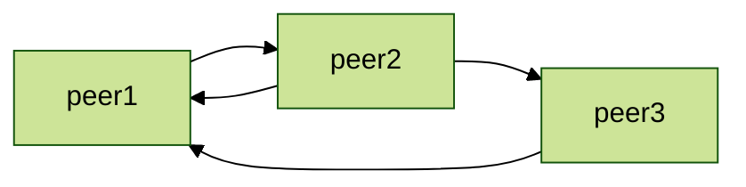
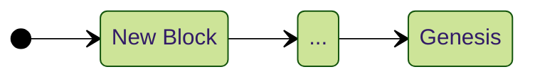
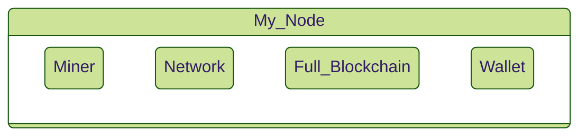
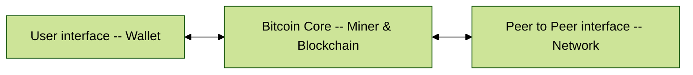
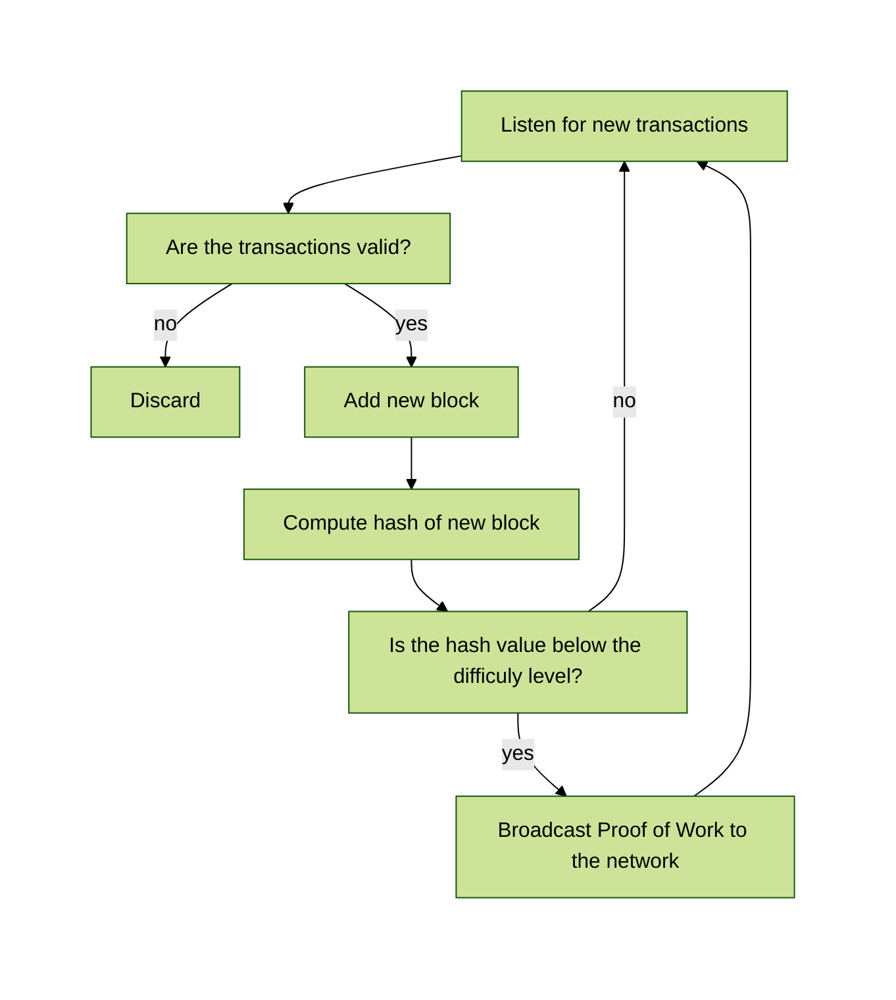
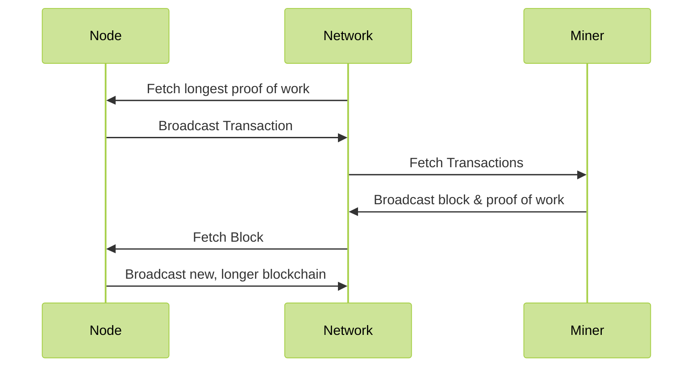

---
title:
 - Bitcoin Core -- Conceptual Architecture
author:
 - Cain Susko & Yash Patel
theme:
 - CambridgeUS
colortheme: 
 - seagull
date:
---

# What is Bitcoin?
 - Bitcoin is a unit of currency used to retain, send, & receive value among
   participants in the Bitcoin network.
 - Participants in the Bitcoin network communicate with each other through the
   Internet -- using a protocol which can be run on a wide range of computing
   devices (including laptops and smart-phones).
 - The Bitcoin protocol uses a peer-to-peer architecture which means that
   participants in the network communicate directly with each other -- rather
   than through a centralized server.

# What is Bitcoin Core?
 - Bitcoin Core is a reference implementation of the Bitcoin system and the
   authoritative reference for technology implementation.
 - Goals: open-source, peer-to-peer, private electronic payment system.
 - Main architecture style: peer-to-peer with layers dividing the user
   interface, local system, and peer network.
 - Submodules and components: nodes, wallet, keys, transactions and `blockchain`.

# About Bitcoin Core
 - About the Bitcoin Core system
 - Nodes
 - `BlockChain` and Blocks
 - Wallets, Keys, and Transactions

# About the Bitcoin Core System
 - Purely peer-to-peer electronic payment system
 - Network formed by nodes (computers running Bitcoin software)
 - Three main node types: full, miner, and light nodes
 - Full nodes store full copy of `blockchain` and verify transactions
 - Nodes broadcast valid transactions to others, leading to agreement and
   addition to pool of valid transactions.

## Peer to Peer

# `Blockchain` 
 - `Blockchain` is a back-linked list of blocks and transactions, can be
   thought of as a stack
 - Blocks placed at the top, referencing previous block (parent block)
   through header
 - Genesis block is the first block ever created

## `Blockchain`

# Blocks 
 - Container data structure scheduling transactions for inclusion in public
   ledger (`blockchain`)
 - Two components: header and body
 - Header contains metadata (previous block hash, difficulty, timestamp, nonce,
   merkle tree root)
 - Body contains all transaction data (on average, more than 1900 transactions)

# Nodes
<!-- https://cypherpunks-core.github.io/bitcoinbook/ch08.html -->
A node is any computing device running the Bitcoin Core protocol. A node can have
any of three functions:

 - Wallet -- manage user Bitcoin
 - Miner -- Create proof of work for transactions
 - Full `blockchain` -- A copy of the entire `blockcain`, for transaction verification

Additionally, all nodes have networking functions to send and receive messages
on the P2P network.

 - Network Routing 

## A Fully Featured Node

# Node Architectural Style
 - Peer-to-peer architecture in operational view
 - Layered style in functional viewpoint
 - Top layer: user interface (cell phone apps or websites)
 - Second layer: local version of Bitcoin software (full, miner, or light node)
 - Third layer: connection layer (peer-to-peer network for formatting, sending,
   and receiving messages)

## Layered Architecture

# Full & Light Nodes

## Full Nodes
 - Contain complete copy of the `blockchain` -- Full `Blockchain`.
 - Are the primary method of verifying transactions, using the complete chain.
 - Broadcast a transaction to the network once verified.

## Light Nodes
 - Contain a subset of the `blockchain`.
 - Use a simplified verification method, but still broadcast to the network
   like Full nodes.
 - Used in situations with limited computing resources.

# Miner Nodes
 - Collect verified transactions into blocks
 - Generate a suitable proof of work for the newly created block
   - This proof of work is a hash generated from the header of the block --
     which must satisfy certain bounds to be accepted by the `blockchain`.

They then broadcast this proof of work back to the P2P network -- where nodes
can then add it to their `blockchain`.

# Wallets, Keys, and Transactions
A Wallet is the primary interface to control & access a user's Bitcoin.

 - Manages keys and addresses, tracks balance, creates and signs transactions
 - Does not contain Bitcoin, but rather keys to "coins" on the network

## Types of Wallets
 - Nondeterministic: keys independently generated, each key must be backed up
 - Deterministic (seeded): keys derived from common master key (seed), seed is
   the only thing that needs to be backed up for efficient system.

# Control and Data flow
 - The secure transaction process begins with a timestamp server taking a hash
   of a block of items and publishing the hash
 - New transactions are broadcast to all nodes in the network, and each node
   collects the transactions into a block and finds a proof-of-work
 - The nodes accept a block if its transactions are valid and not spent, and
   they work on extending the longest `blockchain` as the correct one
 - In the event of two nodes broadcasting two different blocks, the nodes will
   work on the one received first, and save the other in case it becomes longer
 - Block broadcasts are tolerant of dropped messages, and nodes can leave and
   rejoin the network, accepting the longest proof-of-work chain as the correct
   one.

# Data Flow -- Miner

# Concurrency
<!-- https://cypherpunks-core.github.io/bitcoinbook/ch10.html -->
Bitcoin Core nodes rely on decentralized consensus to ensure there are no discrepancies
between nodes -- and to decide which is the correct `blockchain`.

 - Independent verification of each transaction by every full node based on
   a comprehensive list of criteria.
 - Independent aggregation of those transactions into new blocks by mining
   nodes, coupled with demonstrated computation through a Proof-of-Work
   algorithm
 - Independent verification of the new blocks by every node and assembly into a chain
 - Independent selection, by every node, of the chain with the most cumulative
   computation demonstrated through Proof-of-Work

# Consensus

# Responsibility Division between Developers
 - Bitcoin Core developed by Satoshi Nakamoto in 2009 with goal of creating a
   new territory of freedom.
 - After Satoshi's departure, open-source project sustained by a large
   community of programmers.
 - Responsibility division between developers is loose & flexible, allowing for
   quick feature additions but lacking financial or social incentive for larger
   improvements.
 - Consistent group of committers and designated maintainer ensure project
   stability.

# System Evolution
 - Bitcoin Core has been in development for over 10 years
 - Supports `blockchain`, transactions, contracts, wallets, payment processing,
   mining, and P2P network
 - Analysis covers version 12 (2016) to version 24 (most recent at time of
   writing)
 - 2 version updates per year
 - Analysis covers fee handling, wallet implementation, GUI changes, security
   updates, and future steps.

# Fee Handling
 - Fees are the amount paid to miner for including transaction in a block
 - In v12, low fee transactions may not be included in blocks, leading to v12
   introducing replace-by-fee
 - V13 improved replace-by-fee with child pays for parent policy
 - V14 allows users to prioritize transactions with higher fees
 - V15 implements toggle for replace-by-fee
 - V16 made replace-by-fee the norm, although users can opt out
 - V23 improved fee estimation by taking replace-by-fee transactions into
   account.

# Wallet Implementation
 - **V12** introduced `blockchain` pruning for wallet users to reduce
   unnecessary space usage
 - **V14** allows users to specify where they want to prune their `blockchain`
 - **V15** allows users to create multiple wallets with separate addresses,
   private keys, and funds
 - **V16** implemented Segregated Witness (SegWit) in wallet, increased
   transaction capacity and allowed for lower fees
 - **V16** also introduced bech32 address format
 - **V17** improved coin selection for wallets with branch and bound algorithm

# Further Walet Improvements
 - **V20** introduced Descriptor and Watch-Only wallets
 - **V23** made descriptor wallets the default for improved backup and recovery
 - **V23** can spot typos in bech32 addresses.

# GUI Changes
 - **V17** added toggle for pruning in GUI for casual users
 - **V18** allowed access to multiple wallets from GUI
 - **V19** set bech32 addresses as default option, disabled low-usage payment
   protocol support
 - **V20** added hardware wallet compatibility in GUI
 - **V21** provides full support for hardware wallets.

# Security Updates
 - **V12** introduced Tor support for anonymous network connection and faster
   signature validation.
 - **V22** added I2P and CJDNS support for privacy protection and increased
   multi-sig signatures from 16 to 20.
 - **V18** added hardware wallet compatibility through the Hardware Wallet
   Interaction tool.
 - **V19** discontinued Bloom filters and introduced compact client-side block
   filtering.
 - **V21** reduced transaction re-broadcasting to improve privacy and gave
   nodes 2 extra outgoing connections to increase connection to honest nodes.

# Future Steps
 - V24 introduces Miniscript support for Bitcoin Script programming language.
 - Ongoing evolution of the system: replacing old protocols, improving
   infrastructural calculations, etc.
 - Scalability and security are significant future steps.
 - Need to accommodate larger user base and hardware limitations.
 - Efficient pruning methods may be required for data storage in the future.
 - Security is a concern as hacker capabilities evolve.
 - Quantum computing could revolutionize cybersecurity and affect Bitcoin Core.
 - Old security systems replaced and privacy aids added for security of
   thousands of user funds.

# Final Thoughts
 - Through analysing the bitcoin core system we have found that it is a peer to
   peer network, relying on cryptography to ensure the validity of transactions.
 - The variation in node types allows for a flexible system -- which would be
   integral for any system relying on community participation
 - We have discovered that the system is constantly evolving and changing as new
   needs arise.
 - The development of Bitcoin Core has been driven by a desire for greater
   freedom and has been aided by a large community of programmers around the
   world.
 - It is evident that Bitcoin Core is a sophisticated and and complex system.
   While this report does not go into the implementation of the described
   architecture -- understanding this is integral to getting a firmer grasp of
   the overall operation of the system.
